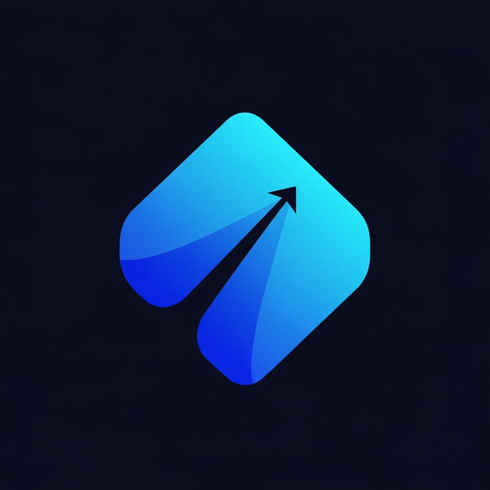

<div align="center">



# FinanceFlow

### A premium personal finance mobile app built with React Native & Expo

[](LICENSE)
[](https://reactnative.dev)
[](https://expo.dev)
[](https://www.typescriptlang.org)
[](CONTRIBUTING.md)

**[Features](#-features) • [Screenshots](#-screenshots) • [Installation](#-installation) • [Tech Stack](#-tech-stack) • [Contributing](#-contributing)**

</div>

---

## 📖 Overview

**FinanceFlow** is a portfolio-quality personal finance mobile application demonstrating modern React Native / Expo development patterns. It features a full premium UI with animated screens, glassmorphism effects, a complete dark/light theming system, and local dummy data — requiring no backend or external APIs.

Built as a showcase project for **[Code With Mukeem](https://github.com/codewithmukeem)**.

---

## ✨ Features

| Screen | Description |
|--------|-------------|
| 🚀 **Splash Screen** | Animated diamond logo with spring reveal, decorative ring layers |
| 🎯 **Onboarding** | 3-slide walkthrough with geometric illustrations and smooth page transitions |
| 🔐 **Login** | Email/password with validation, Google Sign In UI, Continue as Guest |
| 🏠 **Home Dashboard** | Gradient balance header, stat cards, animated weekly bar chart, quick actions |
| 📊 **Analytics** | 6-month overview chart, SVG donut chart by category, spending progress bars |
| 💳 **Wallet** | Horizontal card carousel with gradient credit cards, card management actions |
| 📋 **Transactions** | Live search, category filter chips, full transaction history |
| 👤 **Profile** | Savings goal tracker, theme toggle, notification settings, GitHub link |

**Additional highlights:**
- 🌙 Full **light & dark mode** with semantic color tokens
- ✨ **Glassmorphism** — BlurView tab bar + frosted cards
- 🎬 **Animations** — Reanimated v4 + Animated API entrance transitions  
- 📳 **Haptic feedback** on key interactions  
- 📱 **100% offline** — all data is local dummy data, zero API calls  
- 🔤 **Inter font** (400/500/600/700) throughout  
- ✅ **TypeScript** strict mode everywhere  

---

## 📸 Screenshots

> 📁 Screenshots are located in the [`screenshots/`](screenshots/) folder.

| Splash | Onboarding | Login |
|:------:|:----------:|:-----:|
|  |  |  |

| Home Dashboard | Analytics | Wallet |
|:--------------:|:---------:|:------:|
|  |  |  |

| Transactions | Profile | Dark Mode |
|:------------:|:-------:|:---------:|
|  |  |  |

> **To add screenshots:** Run the app on a device or simulator, take screenshots of each screen, and save them as `screenshots/01_splash.png`, `screenshots/02_onboarding.png`, etc. See [`screenshots/README.md`](screenshots/README.md) for full instructions.

---

## 📱 APK

> A pre-built Android APK is available in the [`apk/`](apk/) folder for direct installation.

See [`apk/README.md`](apk/README.md) for download and installation instructions.

To build your own APK:
```bash
cd artifacts/mobile
npx eas build --platform android --profile preview
```

---

## 🛠 Installation

### Prerequisites

- **Node.js** 18+ (`node --version`)
- **pnpm** 9+ (`npm install -g pnpm`)
- **Expo Go** app on your iOS/Android device — [iOS](https://apps.apple.com/app/expo-go/id982107779) | [Android](https://play.google.com/store/apps/details?id=host.exp.exponent)

### Steps

```bash
# 1. Clone the repository
git clone https://github.com/codewithmukeem/flutter-finance-app.git
cd flutter-finance-app

# 2. Install all dependencies (from the monorepo root)
pnpm install

# 3. Start the Expo development server
pnpm --filter @workspace/mobile run dev
```

You'll see a QR code in the terminal. **Scan it with Expo Go** to run on your device.

### Web preview

The app also runs in the browser:

```bash
# After starting the dev server, press W in the terminal
# Or open: http://localhost:<PORT>
```

### TypeScript check

```bash
pnpm run typecheck
```

---

## 📁 Folder Structure

```
flutter-finance-app/
├── artifacts/
│   └── mobile/                    # 📱 The main Expo app
│       ├── app/
│       │   ├── _layout.tsx        # Root layout, fonts, providers
│       │   ├── index.tsx          # Splash screen
│       │   ├── onboarding.tsx     # 3-slide onboarding
│       │   ├── login.tsx          # Authentication screen
│       │   └── (tabs)/
│       │       ├── _layout.tsx    # Tab bar (NativeTabs/Classic)
│       │       ├── index.tsx      # Home dashboard
│       │       ├── analytics.tsx  # Charts & analytics
│       │       ├── wallet.tsx     # Card management
│       │       ├── transactions.tsx  # Transaction history
│       │       └── profile.tsx    # Settings & profile
│       ├── assets/
│       │   └── images/icon.png    # App icon
│       ├── components/
│       │   ├── BarChart.tsx       # Animated weekly bar chart
│       │   ├── DonutChart.tsx     # SVG donut/pie chart
│       │   ├── GlassCard.tsx      # Glassmorphism card container
│       │   ├── QuickAction.tsx    # Home quick action buttons
│       │   ├── StatCard.tsx       # Income/expense/savings cards
│       │   ├── TransactionItem.tsx # Transaction list row
│       │   └── WalletCard.tsx     # Credit card UI
│       ├── constants/
│       │   └── colors.ts          # Design tokens (light + dark themes)
│       ├── context/
│       │   └── AppContext.tsx     # Theme, auth, onboarding state
│       ├── data/
│       │   └── dummyData.ts       # All local dummy data
│       ├── hooks/
│       │   └── useColors.ts       # Active colour palette hook
│       └── app.json               # Expo configuration
├── screenshots/                   # 📸 App screenshots
├── apk/                           # 📦 Pre-built Android APK
├── LICENSE                        # MIT License
├── README.md                      # This file
└── CONTRIBUTING.md                # Contribution guidelines
```

---

## 🧰 Tech Stack

| Layer | Technology | Version |
|-------|-----------|---------|
| **Framework** | React Native + Expo | SDK 54 |
| **Navigation** | Expo Router (file-based) | v6 |
| **Language** | TypeScript (strict mode) | 5.9 |
| **Animations** | react-native-reanimated | v4.1 |
| **Charts** | react-native-svg (donut), custom View (bar) | 15.12 |
| **Gradients** | expo-linear-gradient | 15.0 |
| **Blur / Glass** | expo-blur (BlurView) | 15.0 |
| **Icons** | @expo/vector-icons (Feather) | 15.0 |
| **State** | React Context + AsyncStorage | — |
| **Fonts** | Inter via @expo-google-fonts | — |
| **Haptics** | expo-haptics | 15.0 |
| **Build tooling** | pnpm workspaces | 9+ |

---

## 🗺 Roadmap

- [ ] Budget screen with per-category limits and overspend alerts
- [ ] Savings goals with progress tracking
- [ ] Bill reminders and recurring expense tracking
- [ ] Currency converter
- [ ] CSV / PDF export of transactions
- [ ] Biometric authentication (Face ID / Fingerprint)
- [ ] Real bank account connection (Plaid SDK)
- [ ] Push notifications for spending alerts
- [ ] iPad / tablet layout support
- [ ] Localization (Arabic, Spanish, French)

---

## 🤝 Contributing

Contributions are welcome! Please read the [Contributing Guide](CONTRIBUTING.md) before submitting a pull request.

1. Fork the repository
2. Create your feature branch: `git checkout -b feature/amazing-feature`
3. Commit your changes: `git commit -m 'feat: add amazing feature'`
4. Push to the branch: `git push origin feature/amazing-feature`
5. Open a Pull Request

---

## 📄 License

This project is licensed under the **MIT License** — see the [LICENSE](LICENSE) file for details.

---

## 👨‍💻 Author

<div align="center">

**Mukeem Javaid**

*Code With Mukeem*

[](https://github.com/codewithmukeem)

*If you found this project helpful, please consider giving it a ⭐ on GitHub!*

</div>
